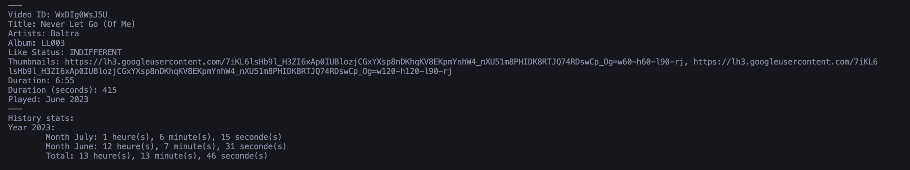

# YTMusic-Tracker
 Get statistics about your yt music usage

## 🌞 Preview



## 🍀 Installation

### Requirements

- Python 3.0 or higher
- pip

### Install

```bash
git clone
cd YTMusic-Tracker
pip3 install ytmusicapi
ytmusicapi oauth ## From https://ytmusicapi.readthedocs.io
```

If you can't run ytmusicapi, try to run this python script in the project folder:
```py
import ytmusicapi
ytmusicapi.setup_oauth("oauth.json")
```

## ❤️ Usage

```bash
python3 main.py
```

## License

[MIT](https://choosealicense.com/licenses/mit/)
